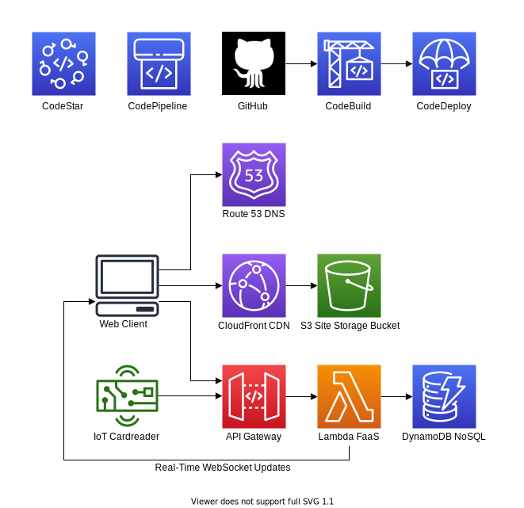

# Digitize

This project began as the SCU COEN 315 - Web Architecture and Protocols final project. Not surprisingly, it was abandoned the day after it was submitted for a grade. It has since turned into an exercise in converting a serverful web app into its serverless equivalent using AWS managed services.

This repository holds the frontend of the site.

### External links:
- [Website](https://digitize.aleonard.dev)
- [Backend repository](https://github.com/leonardishere/DigitizeBackend)

### Technologies used:
- React.js
- Node.js
- Bootstrap
- AWS CloudFront
- AWS S3
- AWS CodePipeline
- AWS CloudFormation
- WebSockets

### Architecture
Below is a high-level architecture diagram for Digitize.
This repository includes the CloudFront CDN, S3 site storage bucket, the site code, and the Route 53 DNS entries to access the site. Infrastructure and code are continuously integrated and deployed with CodeStar.

### Todo list:
- [x] Create CI/CD Pipeline
- [x] Migrate from EC2 LAMP instance to S3, CloudFront
- [x] Migrate from JQuery to React.js, Node.js
- [x] Connect to API
  - [x] Students
  - [x] Active checkins
  - [x] Inactive checkins
  - [x] Dismiss class
  - [x] WebSockets
- [x] Add architecture diagram to the README
- [ ] Use more React-like components, object hierarchy
- [ ] Use hooks
- [ ] Test

### Future work:
- More than one classroom/school
- More detailed attendance analysis
- Automated attendance grading
- Connect to SCU Students database
- Staff login
